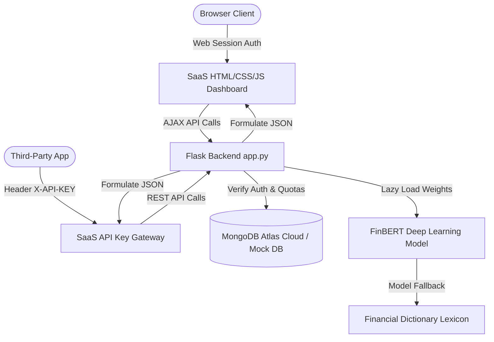

# 🤖 StockAI SaaS — Intelligent Sentiment Terminal & Cloud Portal

**StockAI SaaS** is a state-of-the-art, multi-tenant Software-as-a-Service (SaaS) platform that performs real-time financial news sentiment analysis and generates buy/sell/hold trading decisions. 

By leveraging a pre-trained **FinBERT (Financial BERT)** deep learning model combined with an intelligent rule-based trading agent, the platform turns raw market headlines into actionable trading insights. It features user authentication backed by **MongoDB Atlas**, tiered rate-limiting quotas, direct Developer API tokens, recent request audits, circular browser favicons, and a gorgeous glassmorphism control panel with live Chart.js analytics.

---

## ✨ Premium SaaS Features

- **MongoDB Atlas Cloud Database**: Fully migrated data persistence layer targeting high-performance MongoDB clusters.
- **Zero-Friction In-Memory Fallback**: Automatically activates a local Mock MongoDB engine if cloud clusters are offline or unconfigured, ensuring 100% server booting resilience.
- **Double-Gate Authentication**: Supports secure HTTP session cookies (for browser dashboard users) and custom token headers (`X-API-KEY: sk_live_...`) for external developer API integrations.
- **Subscription Tier Quotas & Rate-Limiting**:
  - **Free Plan**: 5 requests/day. Access to core tickers. Standard browser access.
  - **Pro Plan ($49/mo)**: 100 requests/day. Access to premium tickers, Developer API keys, and standard support.
  - **Enterprise Plan ($199/mo)**: Unlimited requests. Priority dedicated GPU queues and 24/7 priority support.
- **Developer API Token Portal**: Generate, copy, reveal, and rotate secure developer keys. Includes code templates in Python and cURL with direct copy clips.
- **Advanced Mongo Aggregations**: Leverages native MongoDB aggregation pipelines (`$match`, `$group`, `$sort`, `$limit`) to dynamically compile top ticker searches and 7-day query timeline dashboards.
- **Immersive Dark slate UI**: 
  - Glassmorphic panels with dynamic hover animations.
  - Custom horizontal sentiment bars displaying FinBERT Positive/Negative/Neutral confidence percentages.
  - Circular doughnut gauges tracking active daily quota consumption.
  - 7-day request intensity line graphs driven by **Chart.js**.
  - Circular premium glowing logo brand favicon preventing browser console resource warnings.
- **Failure-Safe Hybrid Core**: Deferring heavy neural network loading lazily so the web server boots in milliseconds, plus a high-fidelity dictionary sentiment analyzer fallback if PyTorch or transformers are slow or run on offline CPUs.

---

## 📐 Platform Architecture



---

## 📦 Project Structure

```text
AI-Stock-Action-Agent/
├── app.py                     # Flask SaaS Backend (Auth, Billing, /favicon, API logs)
├── finbert_model.py           # ML Core (Graceful imports, FinBERT weights, Lexicon fallback)
├── saas_db.py                 # MongoDB Data Layer (Atlas connection, Aggregations, Rate Limits)
├── .env                       # Environment Configurations (MONGO_URI, SECRET_KEY) [NEW]
├── requirements.txt           # Python application dependencies (Includes pymongo, dotenv)
├── templates/
│   └── index.html             # Premium glassmorphic single-page SaaS dashboard UI
└── static/
    ├── favicon.png            # Premium circular neon-glowing brand favicon logo [NEW]
    ├── css/
    │   └── style.css          # Immersive dark HSL slate design system stylesheets
    └── js/
        └── app.js             # Frontend controller (Routing, Stripe checkout, Chart.js)
```

---

## 🚀 Setup and Installation

### Prerequisites
- Python 3.9 or higher installed.
- Internet access during first query to download pre-trained FinBERT weights (automatically cached locally by HuggingFace).

### 1. Clone and Navigate
```bash
git clone https://github.com/your-username/AI-Stock-Action-Agent.git
cd AI-Stock-Action-Agent
```

### 2. Configure Environment variables
Create a `.env` file in the project root:
```env
# MongoDB Atlas Connection URI
MONGO_URI=mongodb+srv://<username>:<password>@cluster0.mongodb.net/stockai_saas?retryWrites=true&w=majority

# Flask Session Security Key
SECRET_KEY=05021f1a99b9d99d12d85e7f141c97b42b12b7468edb2498
```
*(If `MONGO_URI` is omitted or unconfigured, the data layer automatically boots into an in-memory Mock MongoDB fallback for safe testing).*

### 3. Create Virtual Environment & Activate
```bash
# Create environment
python -m venv venv

# Windows Activation:
.\venv\Scripts\activate

# Linux/macOS Activation:
source venv/bin/activate
```

### 4. Install Dependencies
```bash
pip install -r requirements.txt
```
*(Dependencies include `flask`, `pymongo[srv]`, `python-dotenv`, `requests`, `numpy`, `torch`, `transformers`, `pandas`, and `scikit-learn`).*

### 5. Run the Application
```bash
python app.py
```
On startup, the system will verify connections to the MongoDB cloud cluster, set up search indexes, and launch the web server.

### 6. Access the Platform
Open your browser and navigate to:
**`http://127.0.0.1:5000/`**

---

## ⚙️ SaaS API Endpoint Directory

All responses return standard JSON payloads. Endpoints marked with 🔑 require standard browser session auth or the developer header: `X-API-KEY: sk_live_...`.

| Method | Endpoint | Auth Required | Description |
| :--- | :--- | :---: | :--- |
| **POST** | `/api/register` | No | Register a fresh username and password account. Automatically logs user in. |
| **POST** | `/api/login` | No | Authenticate credentials and establish session cookies. |
| **POST** | `/api/logout` | No | Terminate the current session. |
| **GET** | `/api/user` | Session | Get active user profile details, created_at timestamp, active tier, and remaining quota. |
| **POST** | `/api/upgrade` | Session | Upgrade subscription tier (`pro` or `enterprise`). Mock-Stripe verification. |
| **POST** | `/api/apikey/regenerate` | Session | Invalidate current developer token and generate a fresh key. |
| **GET** | `/api/stats` | Session | Fetch aggregated logs, daily intensity arrays, and top stocks queries. |
| **GET** | `/api/action/<ticker>` | 🔑 Yes | Trigger FinBERT/Lexicon sentiment sweeps. Returns BUY/SELL/HOLD and event reports. |
| **GET** | `/favicon.ico` | No | Serves the premium circular favicon image to prevent 404 console warnings. |

---

## 🧪 Automated System Verification

We have created an automated integration script to test the SaaS endpoints, security constraints, and rate-limiting triggers directly on the live database.

To run the verification suite:
1. Ensure the Flask server is running.
2. Execute the verification script:
```bash
python "C:\Users\veera\.gemini\antigravity-ide\brain\476bb5e7-19a7-49dd-8a91-9202cabd2ca6\scratch\test_saas.py"
```

### Expected Test Output Lifecycle:
1. **User Account Creation**: Registers a randomized developer account (`saas_tester_<timestamp>`).
2. **Quota Bounds Validation**: Executes 5 consecutive calls. The 6th request triggers a `429 Too Many Requests` limit block.
3. **Billing Upgrades**: Triggers a payment checkout upgrading the account to the `Pro` tier.
4. **Limiter Expansion**: Retries the 6th call, verifying it bypasses the 5-request block.
5. **API Token Gateway Check**: Sends a request using the direct `X-API-KEY` header without session cookies to verify third-party developer integrations.
6. **Audit Aggregation Logs**: Retries dashboard stats to verify metrics are accurately compiled.
